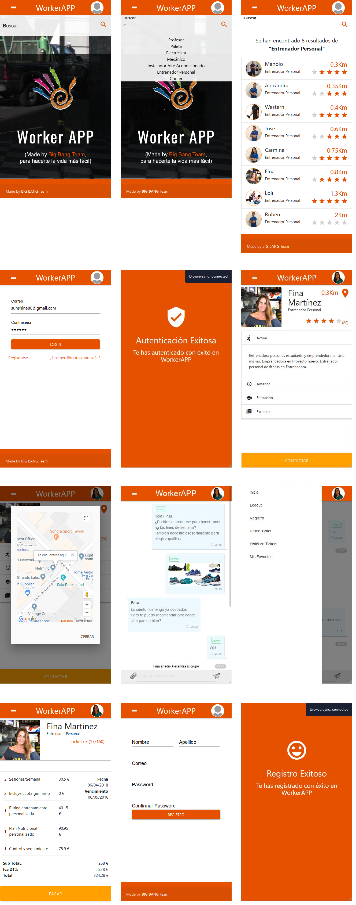
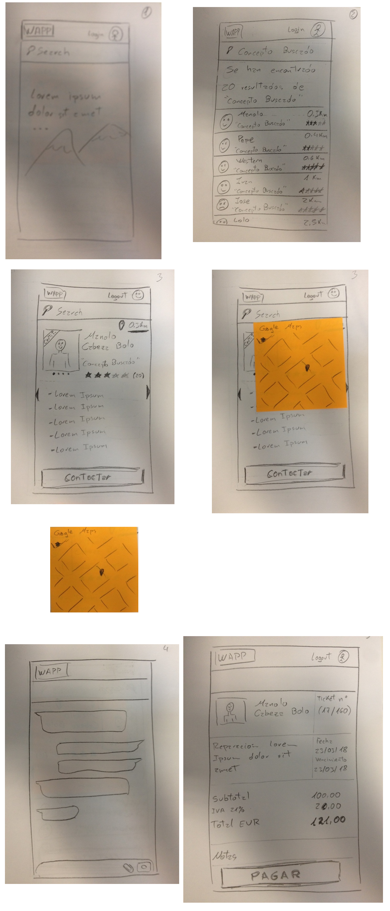
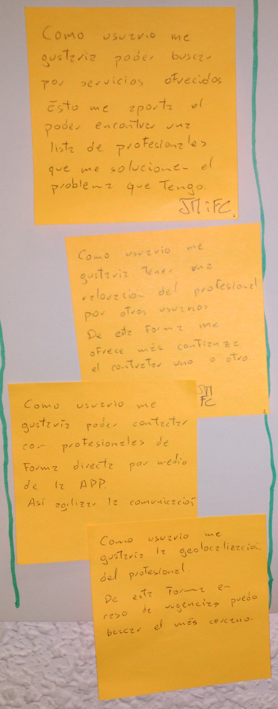
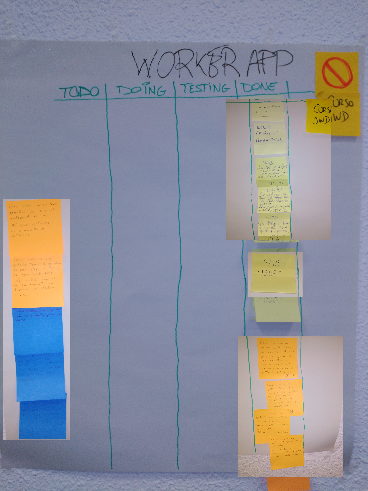

# Worker-App

La evolución de este proyecto está disponible en [WorkerApp2](https://github.com/bugtamer/WorkerApp2).

## Frontend

+ HTML
+ CSS
+ Javascript
+ [jQuery](https://jquery.com/)
+ [MaterializeCSS](https://materializecss.com/)
+ [Google Maps API](https://developers.google.com/maps/documentation/javascript/tutorial)
+ [Geolocation Web API](https://developer.mozilla.org/en-US/docs/Web/API/Geolocation)
+ [WebShocket](https://developer.mozilla.org/en-US/docs/Web/API/WebSockets_API)

## Backend

+ [lite-server](https://www.npmjs.com/package/lite-server) ([localhost](http://localhost:3000/))
+ [www.mocky.io](http://www.mocky.io)

## SW adicional

+ Visual Studio Code
+ Google Chrome / Chromium 70 (64 bits)
+ Mozilla Firefox 61
+ [www.draw.io](https://www.draw.io/)
+ Microsoft Teams

## Snapshots

## Sketches

## Historias de usuario

+ Historias de usuario implementadas:

## Scrum

